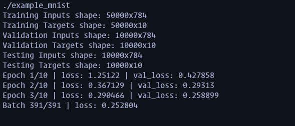

<h1 align="center">LiteNet</h1>

<p align="center">LiteNet is a neural network framework written in C++ with 0 external dependencies. It is designed to be easy to use, with a simple and intuitive API based on the Keras    and PyTorch libraries. All linear algebra operations are implemented from scratch with the C++ standard library.</p>

⚠ **This project is solely for educational purposes. It is not intended to be used in production.**



## Motivation

> Why make a neural network framework? Why in C++? Why no dependencies?

1. _Why make a neural network framework?_ I wanted to learn more about neural networks and how they work under the hood (backpropagation, optimization algorithms, etc.).
2. _Why in C++?_ I wanted to learn more about C++ and how to write efficient code. C++ is a powerful language that allows for low-level control and high performance.
3. _Why no dependencies?_ I wanted to challenge myself to implement everything from scratch. This includes linear algebra operations (matrix multiplication, element-wise operations, etc.), activation functions, loss functions, optimizers, etc.

## Example Usage (handwritten digit recognition)

For the full example, see [src/example_mnist.cpp](src/example_mnist.cpp).

Model architecture:

- Input layer (784 neurons)
- Dense layer (256 neurons, ReLU activation)
- Dense layer (128 neurons, ReLU activation)
- Dense layer (64 neurons, ReLU activation)
- Dense layer (32 neurons, ReLU activation)
- Output layer (10 neurons, Softmax activation)
- Loss function: Categorical Cross Entropy
- Optimizer: Adam

```cpp
// Build
const double learningRate = 0.0001;
litenet::Model model;
model.add(std::make_unique<litenet::layers::Dense>(784, 256, "relu", std::make_unique<litenet::initializers::HeUniform>()));
model.add(std::make_unique<litenet::layers::Dense>(256, 128, "relu", std::make_unique<litenet::initializers::HeUniform>()));
model.add(std::make_unique<litenet::layers::Dense>(128, 64, "relu", std::make_unique<litenet::initializers::HeUniform>()));
model.add(std::make_unique<litenet::layers::Dense>(64, 32, "relu", std::make_unique<litenet::initializers::HeUniform>()));
model.add(std::make_unique<litenet::layers::Dense>(32, 10, "softmax", std::make_unique<litenet::initializers::GlorotUniform>()));
model.compile("categorical_crossentropy", std::make_unique<litenet::optimizers::Adam>(learningRate));

// Train
const int epochs = 8;
const int batchSize = 128;
model.fit(trainingInputs, trainingTargets, epochs, batchSize, validationInputs, validationTargets);

// Predict
litenet::Matrix predictions = model.predict(inputs);

// Evaluate
std::vector<double> results = model.evaluate(testingInputs, testingTargets);
std::cout << "Loss: " << results[0] << std::endl;
std::cout << "Accuracy: " << results[1] << std::endl;
```

Results: (on MNIST dataset: 50,000 training samples, 10,000 validation samples, 10,000 testing samples)

```
Epoch 1/8 | loss: 0.836841 | val_loss: 0.31251
Epoch 2/8 | loss: 0.269037 | val_loss: 0.19455
Epoch 3/8 | loss: 0.202645 | val_loss: 0.165277
Epoch 4/8 | loss: 0.1673 | val_loss: 0.147121
Epoch 5/8 | loss: 0.14387 | val_loss: 0.133752
Epoch 6/8 | loss: 0.128119 | val_loss: 0.131927
Epoch 7/8 | loss: 0.118322 | val_loss: 0.128091
Epoch 8/8 | loss: 0.111184 | val_loss: 0.128207

Loss: 0.136428
Accuracy: 0.9364
```

## Features

- [ ] Layers
  - [x] Dense
  - [ ] Conv2D
  - [ ] MaxPooling2D
  - [ ] Flatten
  - [x] Dropout
- [x] Activation Functions
  - [x] ReLU
  - [x] Leaky ReLU
  - [x] Sigmoid
  - [x] Tanh
  - [x] Softmax
- [x] Loss Functions
  - [x] Mean Squared Error
  - [x] Mean Absolute Error
  - [x] Binary Cross Entropy
  - [x] Categorical Cross Entropy
- [x] Optimizers
  - [x] Stochastic Gradient Descent (mini-batch)
  - [x] Adam
  - [x] AdamW
  - [x] RMSprop
  - [x] Adagrad
- [ ] Metrics
  - [x] Accuracy
  - [ ] Precision
  - [ ] Recall
  - [ ] F1 Score
- [x] Initializers
  - [x] Random Normal
  - [x] Random Uniform
  - [x] Glorot Normal
  - [x] Glorot Uniform
  - [x] He Normal
  - [x] He Uniform
  - [x] Zeros
  - [x] Ones
- [ ] Regularizers
  - [ ] L1
  - [ ] L2
